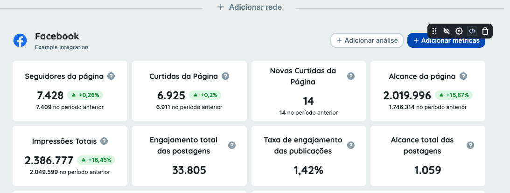
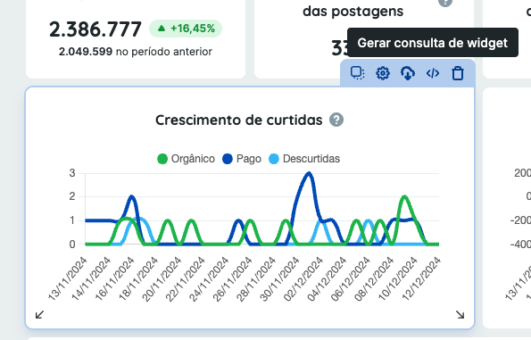
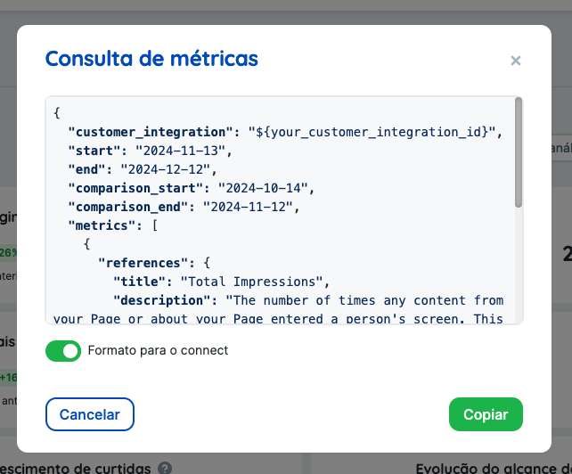

Metrics
======

Endpoints:

- [Get metrics data](#get-metrics-data)
- [Get metrics data asynchronously](#get-metrics-data-async)

This endpoint allows you to recreate exactly a dashboard present in Reportei Application, so we **HIGHLY** recommend you to check the [Reportei Application](https://app.reportei.com), create a test account, integrate your networks, generate a dashboard and then use this endpoint to get the data.

Once you customized the dashboard, you can copy the JSON payload by hovering over the integration block or a specific widget and clicking the **</>** icon.

**Copy JSON Payload From Integration Block**
This will generate a JSON payload with the entire dashboard data.



**Copy JSON Payload From Widget**
This will generate a JSON payload with the single widget data only.



This pops up a modal with the JSON payload, you can copy it and use it in this endpoint.

Once you copy it you will have the full payload for all endpoints documented on this section.



**Note**: Dont forget to tick the "Format for Connect" checkbox.

Get metrics data
--------------

* `POST /metrics/get-data` will return an object with the values of the requested metrics from a customer integration.

_Required parameters_:

* `customer_integration` - $uuid of desired customer integration.
* `start` - Analysis start date (ISO 8601)
* `end` - Analysis end date (ISO 8601)
* `metrics` - Array containing metric structure

_Optional parameters_:

* `comparison_start` - Comparison start date (ISO 8601)
* `comparison_end` - Comparison end date (ISO 8601)

This endpoint will return an object with the values of the requested metrics.

_Metric Structure_:
1. `id`: A unique identifier for the metric.
2. `reference_key`: The general name of the metric, e.g., ig:story_replies (Instagram story replies).
3. `metrics`: An array of specific metric values requested, e.g., replies.
4. `dimensions` (optional): Additional breakdown of the metric, e.g., stories, date, device.
5. `component`: The type of the metric, which alters the final response structure. The available component types are:
    * `number_v1`: Returns a single numerical value.
    * `datatable_v1`: Returns tabular data.
    * `chart_v1`: Returns data in a format that can be visualized in a chart.
6. `entity_id`: Id of the entity you want to filter the results by (ad id, campaign id or adset id)
7. `entity_type`: Type of the entity you want to target (ad, campaign or adset)

**If you dont want to copy the payload from an existing Reportei dashboard, there is a list of available metrics and dimensions per integration in the link below.**

[Payloads](https://github.com/reportei/connect-docs/blob/master/payloads)

Every folder in `/payloads` contains two json files: `metrics.json` which contains predefined metrics with specific components and `setup.json` which contains the available metrics and dimensions to build your own payloads.

**Note**: Depending on the network of the customer integration, some combinations of metrics and dimensions may not be compatible.


###### Example JSON Request
This example includes 3 different metrics: `ig:story_replies` (number_v1), `ig:followers_gender` (chart_v1), and `ig:story_replies` (datatable_v1).

``` json
{
  "customer_integration": "4addc0da-8583-4dbb-a0e9-c7e2e8470f50",
  "start": "2024-01-01",
  "end": "2024-09-01",
  "metrics": [
    {
        "id": "f35a44ce-dac5-4188-aace-5c44a8952176",
        "reference_key": "ig:story_replies",
        "component": "number_v1",
        "metrics": [
            "replies"
        ],
        "dimensions": [
            "stories"
        ]
    },
    {       
      "id": "3051ed66-a05c-462a-aece-e1d900e78b02",
      "reference_key": "ig:followers_gender",
      "component": "chart_v1",
      "metrics": [
          "followers"
      ],
      "dimensions": [
          "gender"
      ]
    },
    {
      "id": "b3a949ac-f6ae-4bd1-bb90-1e8e0cbe8ed5",
      "reference_key": "ig:clicks_breakdown",
      "component": "datatable_v1",
      "metrics": [
          "count",
          "ctr"
      ],
      "dimensions": [
          "clicks_breakdown"
      ],
    }
  ]
}
```

###### Example JSON Response

``` json
{   
  "f35a44ce-dac5-4188-aace-5c44a8952176": {
    "values": 55645,
    "comparison": {
         "values": null,
         "difference": null,
         "absoluteDifference": null
    }
  },
  "3051ed66-a05c-462a-aece-e1d900e78b02": {
      "labels": [
          "Male",
          "Female",
          "Unknown"
      ],
      "values": [
        {
          "data": [
            12628,
            8815,
            2745
          ]
        }
      ]
  },
  "b3a949ac-f6ae-4bd1-bb90-1e8e0cbe8ed5": {
    "values": [
      [
        "Email",
        2,
        0.0002254283137962128
      ],
      [
        "Websites",
        428,
        0.04824165915238954
      ],
      [
        "Total",
        430,
        0.048467087466185756
      ]
    ]
  }
}
```

<!-- END GET /metrics/get-data -->
###### Copy as cURL

``` shell
curl -X POST https://connect.reportei.com/metrics/get-data \
-H "Authorization: Bearer $ACCESS_TOKEN" \
-H "x-customer-token: $CUSTOMER_TOKEN" \
-H "Content-Type: application/json" \
-d '{
  "customer_integration": "4addc0da-8583-4dbb-a0e9-c7e2e8470f50",
  "start": "2024-01-01",
  "end": "2024-09-01",
  "metrics": [
    {
        "id": "f35a44ce-dac5-4188-aace-5c44a8952176",
        "reference_key": "ig:story_replies",
        "component": "number_v1",
        "metrics": ["replies"],
        "dimensions": ["stories"]
    },
    {
        "id": "3051ed66-a05c-462a-aece-e1d900e78b02",
        "reference_key": "ig:followers_gender",
        "component": "chart_v1",
        "metrics": ["followers"],
        "dimensions": ["gender"]
    },
    {
        "id": "b3a949ac-f6ae-4bd1-bb90-1e8e0cbe8ed5",
        "reference_key": "ig:clicks_breakdown",
        "component": "datatable_v1",
        "metrics": ["count", "ctr"],
        "dimensions": ["clicks_breakdown"]
    }
  ]
}'
```

Get metrics data asynchronously
--------------

* `POST /metrics/get-data-async` initiates a process to gather the requested metrics data and asynchronously posts the results to the provided `metrics_webhook_url`.

_Required parameters_:

* `metrics_webhook_url` - URL that will receive metrics payload.
* `customer_integration` - $uuid of desired customer integration.
* `start` - Analysis start date (ISO 8601)
* `end` - Analysis end date (ISO 8601)
* `metrics` - Array containing metric structure, see the [Get metrics data](#get-metrics-data) endpoint for more info on structure and available metrics.

_Optional parameters_:

* `comparison_start` - Comparison start date (ISO 8601)
* `comparison_end` - Comparison end date (ISO 8601)

This endpoint will return `200 OK` once the process of getting metrics data has started, after the metrics are fetched, the payload containing the metrics data will be posted to the provided `metrics_webhook_url`.

**Note**: The request body structure is identical to the [Get metrics data](#get-metrics-data) endpoint. Similarly, the payload posted to the `metrics_webhook_url` will follow the same format as the [Get metrics data](#get-metrics-data) response.

<!-- END GET /metrics/get-data -->
###### Copy as cURL

``` shell
curl -X POST https://connect.reportei.com/metrics/get-data-async \
-H "Authorization: Bearer $ACCESS_TOKEN" \
-H "x-customer-token: $CUSTOMER_TOKEN" \
-H "Content-Type: application/json" \
-d '{
  "metrics_webhook_url": "https://your-webhook-url.com/receive-metrics",
  "customer_integration": "4addc0da-8583-4dbb-a0e9-c7e2e8470f50",
  "start": "2024-01-01",
  "end": "2024-09-01",
  "metrics": [
    {
        "id": "f35a44ce-dac5-4188-aace-5c44a8952176",
        "reference_key": "ig:story_replies",
        "component": "number_v1",
        "metrics": ["replies"],
        "dimensions": ["stories"]
    },
    {
        "id": "3051ed66-a05c-462a-aece-e1d900e78b02",
        "reference_key": "ig:followers_gender",
        "component": "chart_v1",
        "metrics": ["followers"],
        "dimensions": ["gender"]
    },
    {
        "id": "b3a949ac-f6ae-4bd1-bb90-1e8e0cbe8ed5",
        "reference_key": "ig:clicks_breakdown",
        "component": "datatable_v1",
        "metrics": ["count", "ctr"],
        "dimensions": ["clicks_breakdown"]
    }
  ]
}'
```
